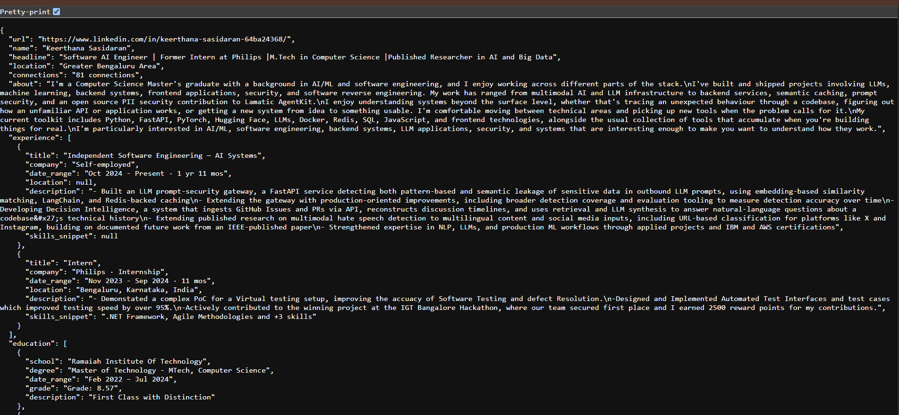
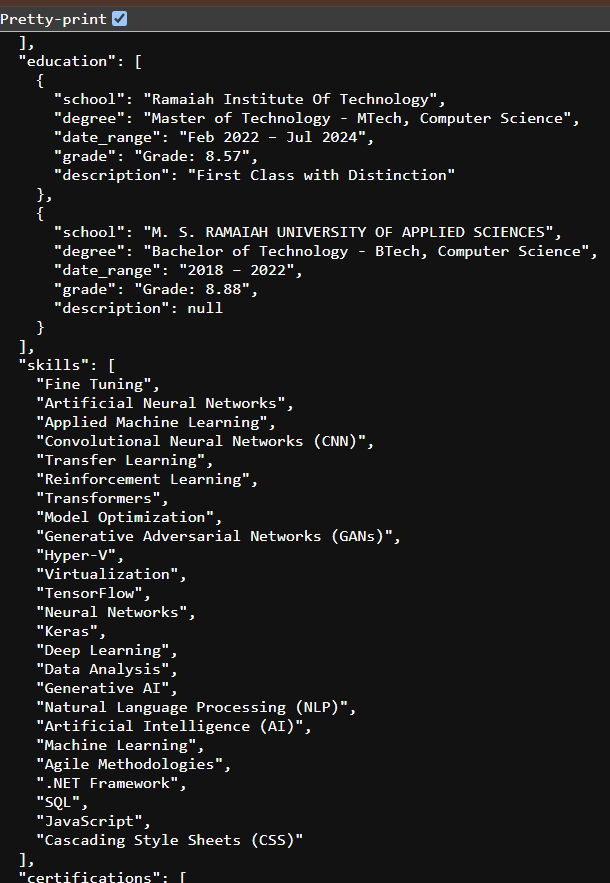
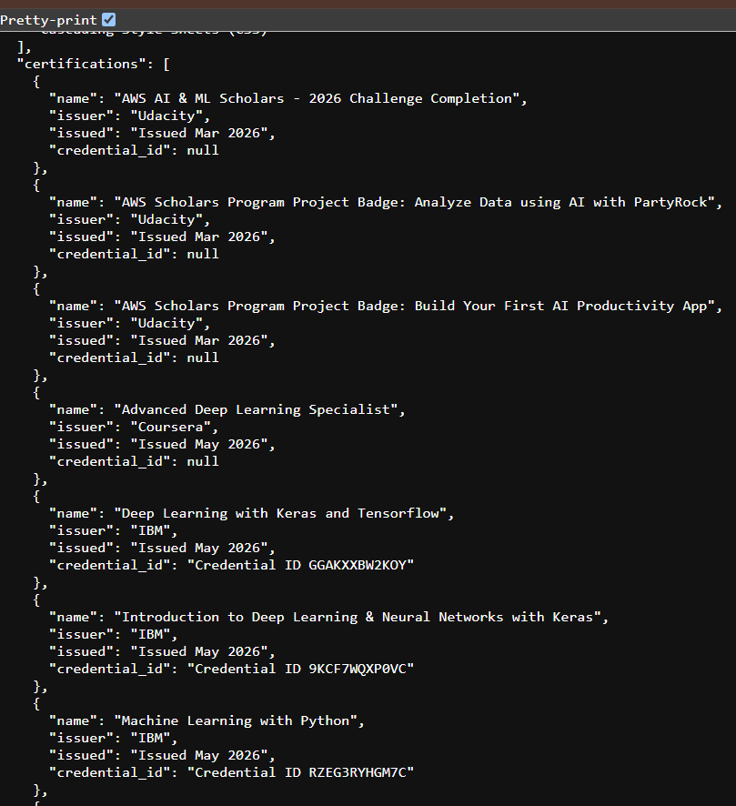
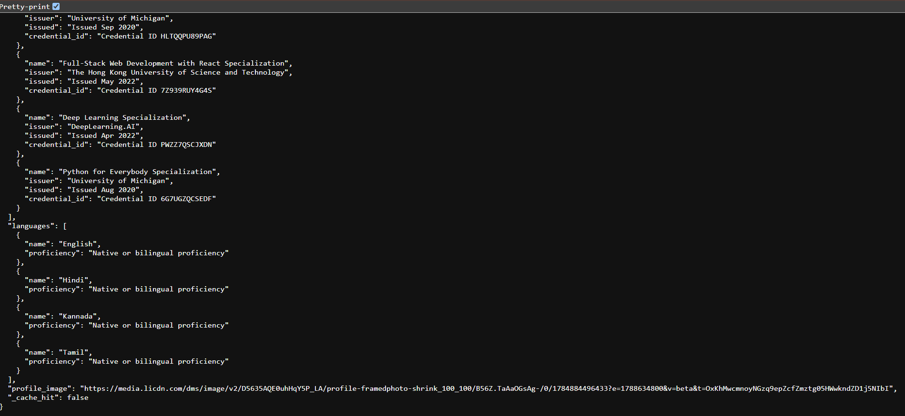
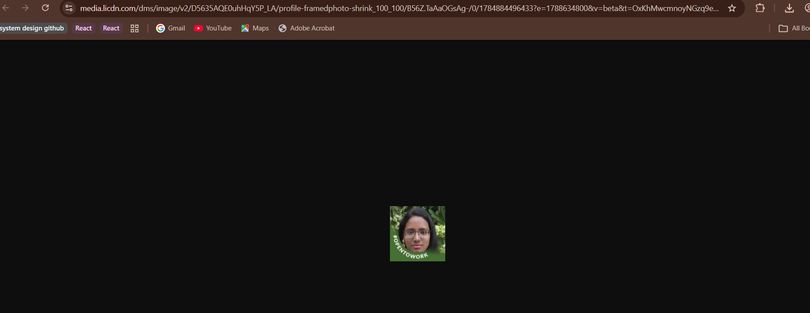

# LinkedIn Profile API

Accepts a LinkedIn profile URL and returns structured JSON with the
information visible on that profile.

**Live deployment**: https://linkedin-profile-api-qs8k.onrender.com
**Demo video**: [Loom link](https://www.loom.com/share/993c8b83cc7d46a6b0882ef6a3805aa9)

## Approach

No browser is used anywhere in this service — every request LinkedIn
sees is a plain authenticated HTTP request, the same shape `curl` would
send.

1. **Login** (`app/linkedin_session.py`): `LINKEDIN_COOKIE_STRING` (a
   full `Cookie:` header value copied from an authenticated browser
   session) is the primary auth method, with `LI_AT_COOKIE` +
   `JSESSIONID` as a lighter two-field fallback and a scripted
   password login kept as a last resort. Cookies are copied from an
   already-logged-in browser session and passed in via env vars, rather
   than the script logging in itself.
   `LINKEDIN_USER_AGENT` must match the real browser the cookies came
   from.

2. **Fetch and parse — topcard** (`app/voyager_client.py`): originally
   built against LinkedIn's classic Voyager REST endpoint
   (`voyager/api/identity/profiles/{id}/profileView`), which is the
   commonly documented approach (including what the reference example,
   PhantomBuster, describes using). **That endpoint now returns 410
   Gone** — LinkedIn has moved profile pages to a newer, proprietary
   "Server-Driven UI" system (internal screen IDs like
   `com.linkedin.sdui.flagshipnav.profile.Profile`, proto-based actions)
   with no publicly documented equivalent endpoint.

   The working approach: the profile **topcard** (name, headline,
   school, location, connection count, profile photo) is still
   server-rendered directly into the plain profile page's HTML on
   initial load. So this service does a plain authenticated GET of the
   profile page itself — still not a browser, just an HTTP request for
   HTML instead of JSON — and extracts those fields from the rendered
   markup using Python's built-in `html.parser` (walking structural
   tags like `<h2>`/`<p>`/`` and the `<title>` tag, not LinkedIn's
   obfuscated/hashed CSS classes, which change on every deploy).

3. **Experience** (`app/voyager_client.py`'s `parse_experience_from_details_html`):
   unlike the topcard's Experience *summary* on the main profile page
   (which loads asynchronously), the dedicated
   `/in/{id}/details/experience/` page turned out to be fully
   server-rendered — full titles, companies, date ranges, locations,
   descriptions, and associated-skills snippets all present in plain
   HTML on initial load, discovered by inspecting that page's real
   source. So experience is fetched from there with the same
   no-browser HTTP GET approach as the topcard, using structural
   regex extraction anchored on each position's stable "edit" link
   rather than its hashed CSS classes.

4. **Education** (`app/voyager_client.py`'s
   `parse_education_from_pagination_response`): unlike experience,
   education's `/details/education/` page genuinely does *not*
   server-render its data — this was directly verified (raw source
   contains only a loading placeholder; a text search for known
   content returns zero results even after a deliberate delay, ruling
   out both "not loaded yet" and streaming/incremental delivery over
   the same connection). Clearing the browser's local/IndexedDB
   storage for linkedin.com and re-capturing surfaced the real
   mechanism: a second request, a `POST` to
   `flagship-web/rsc-action/actions/pagination?sduiid=com.linkedin.sdui.pagers.profile.details.education`
   — a distinct action endpoint LinkedIn's own frontend calls to
   populate this specific section. Still no browser: this is a plain
   HTTP POST with a JSON body, built from a real captured request (see
   `build_education_pagination_payload`). The one piece of information
   needed to build that request body — the profile's internal LinkedIn
   ID — isn't in the vanity URL at all, but *is* embedded directly in
   the `/details/education/` page's own HTML (inside a `componentkey`
   string), so no separate lookup step is needed. The response comes
   back in the same numbered-chunk RSC-stream text format used
   throughout this app's other captures, parsed the same way.

5. **Skills** (`app/voyager_client.py`'s
   `parse_skills_from_pagination_response`): same pagination-endpoint
   mechanism as education, just a different `sduiid`
   (`...pagers.profile.details.skills`), confirmed by capturing a real
   request the same way. One added wrinkle worth documenting: the
   response pairs each skill with an adjacent "associated with"
   string (e.g. a certification or role that skill came from), but
   *which half of each pair is the actual skill name* is not reliably
   determined by position — in the real captured response, the order
   flips partway through (skill-then-context for some entries,
   context-then-skill for others). Rather than guess and risk
   mislabeling a skill as a certification or vice versa, extraction
   uses a separate, unambiguous marker present in the same response:
   each skill has an `"aria-label":"Edit <name> skill"` string next to
   it. Only the skill name itself is extracted this way; the
   associated-context pairing is deliberately left out rather than
   risk getting it wrong.

6. **Certifications** (`app/voyager_client.py`'s
   `parse_certifications_from_pagination_response`): same pagination
   mechanism again (`sduiid=...pagers.profile.details.certifications`),
   confirmed against a real 10-entry response. Cleaner than skills —
   each entry has a consistent field order (issuer → "Issued \<date\>"
   → optional "Credential ID \<id\>"), grouped the same way education's
   entries are: anchor on each entry's real name-content position
   (found via a stable `"Edit license or certification <name>"` marker
   also present in the response), then scan forward to the next entry's
   start.

7. **Languages** (`app/voyager_client.py`'s
   `parse_languages_from_pagination_response`): same pagination
   mechanism (`sduiid=...pagers.profile.details.languages`), confirmed
   against a real 4-language response. The simplest of all the sections
   — a clean, regular sequence of (language, proficiency) pairs with no
   ambiguity, safe to pair positionally.

8. **About** (`app/voyager_client.py`'s `resolve_about_text`): uses a
   different action endpoint from the others —
   `flagship-web/rsc-action/actions/component` (singular), not
   `.../actions/pagination`, since About is one text block, not a list
   — found by identifying the component whose name matched About's
   position on the page (`...profileCardsAboveActivity`, i.e. "the
   component just above the Activity/posts feed"). The first attempt to
   verify this looked like a dead end — a straightforward text search
   of the decoded response found nothing — but that was a false
   negative: About's actual text is delivered as several separate
   rich-text segments (one per paragraph/line-break) referenced through
   a chain of `"$L<id>"` placeholders, not as one plain string like the
   other sections. `resolve_about_text` walks that reference chain
   generically (finds the About `componentKey` → follows its
   `initialContent` pointer → tries each referenced chunk until one
   contains multiple substantial text segments) rather than hardcoding
   chunk numbers, since those numbers differ per response.

Login happens once at process startup and the resulting session is
reused for all requests, rather than logging in per-request.

## Setup

```bash
cp .env.example .env   # fill in your credentials — see .env.example for all options
docker build -t linkedin-profile-api .
docker run --env-file .env -p 8000:8000 linkedin-profile-api
```

Local (non-Docker) dev:

```bash
pip install -r requirements.txt
pip install python-dotenv
uvicorn app.main:app --reload --env-file .env
```

### Getting your session cookie and User-Agent

1. Log into linkedin.com normally in your browser.
2. Open DevTools (F12) → Network tab → check "Disable cache" → refresh
   the page.
3. Click any request going to `www.linkedin.com` (not
   `platform.linkedin.com`).
4. Under Request Headers, right-click **Cookie** → Copy value → paste
   as `LINKEDIN_COOKIE_STRING` in `.env`.
5. In that same panel, copy the **User-Agent** value → paste as
   `LINKEDIN_USER_AGENT` in `.env`.

### Deploying publicly over HTTPS

Any container host with HTTPS termination works, e.g. Fly.io, Render,
or Railway:

```bash
fly launch --dockerfile Dockerfile
fly secrets set LINKEDIN_COOKIE_STRING=... LINKEDIN_USER_AGENT=...
fly deploy
```

## API

### `GET /health`
Returns `{"status": "ok", "logged_in": true|false, "cached_profiles": N, "ttl_seconds": N}`.

Interactive API docs (auto-generated by FastAPI) are available at
`/docs` on any running instance.

Responses are cached in-memory per profile for `CACHE_TTL_SECONDS`
(default 300s) — repeated requests for the same profile within that
window are served from cache instead of re-hitting LinkedIn. Each
response includes `"_cache_hit": true/false`.

```bash
curl "https://linkedin-profile-api-qs8k.onrender.com/profile?url=https://www.linkedin.com/in/someone"
```

Example response shape:

```json
{
  "url": "https://www.linkedin.com/in/someone",
  "name": "Jane Doe",
  "headline": "Software Engineer at Example Co",
  "location": "Bengaluru, Karnataka, India",
  "connections": "500+ connections",
  "about": "A short bio paragraph, if the profile has one written.",
  "experience": [
    {
      "title": "Software Engineer",
      "company": "Example Co",
      "date_range": "Jan 2023 - Present · 1 yr 8 mos",
      "location": "Bengaluru, Karnataka, India",
      "description": "- Built and shipped feature X\n- Owned service Y",
      "skills_snippet": "Python, FastAPI and +3 skills"
    }
  ],
  "education": [
    {
      "school": "Example University",
      "degree": "Bachelor of Technology - BTech, Computer Science",
      "date_range": "2018 – 2022",
      "grade": "Grade: 8.5",
      "description": "First Class with Distinction"
    }
  ],
  "skills": ["Python", "Distributed Systems"],
  "certifications": [
    {
      "name": "Example Certification",
      "issuer": "Example Org",
      "issued": "Issued Jan 2024",
      "credential_id": "Credential ID ABC123"
    }
  ],
  "languages": [
    {"name": "English", "proficiency": "Native or bilingual proficiency"}
  ],
  "profile_image": "https://media.licdn.com/...",
  "_cache_hit": false
}
```
**Screenshots — same response, live:**


*A live response — topcard, about, and experience, all real data.*



*Education and Skills — 25 real entries, extracted via an aria-label anchor to avoid
the ambiguous skill/context pairing described in Approach.*



*Certifications — fetched via the same reverse-engineered pagination
endpoint (see Approach above).*


*Languages — the simplest section, clean (language, proficiency)
pairs.*



*The `profile_image` URL above, opened directly — not just present as
text, actually resolves to the real photo.*

## Error handling

| Situation | HTTP status |
|---|---|
| Malformed profile URL | 400 |
| Profile not found / not visible to this account | 404 |
| LinkedIn rate-limited or blocked this account (999/429) | 429 |
| LinkedIn presented a login checkpoint (2FA/CAPTCHA) | 503 |
| Other auth failure (e.g. session expired mid-request) | 502 |
| Unexpected parse/fetch failure | 500 |

## Known limitations

- **Extraction is pattern-anchored against LinkedIn's undocumented
  response formats** — no official schema exists for them — using
  stable, content-adjacent markers (an "edit" link, an aria-label, a
  component key) rather than LinkedIn's hashed CSS classes, which
  rotate on redeploy. A significant frontend change on LinkedIn's side
  could affect an individual section without affecting the others.
  - **Session-based authentication:** the service establishes an
  authenticated LinkedIn session at startup and reuses it for
  subsequent requests. LinkedIn provides no official token-refresh
  mechanism, so if the upstream session expires or is invalidated,
  the service requires a fresh authenticated session to be supplied.
- **Private or restricted profiles:** The amount of information 
  returned depends on what is available to the authenticated 
  account. Certain fields may be unavailable for private or 
  restricted profiles.
